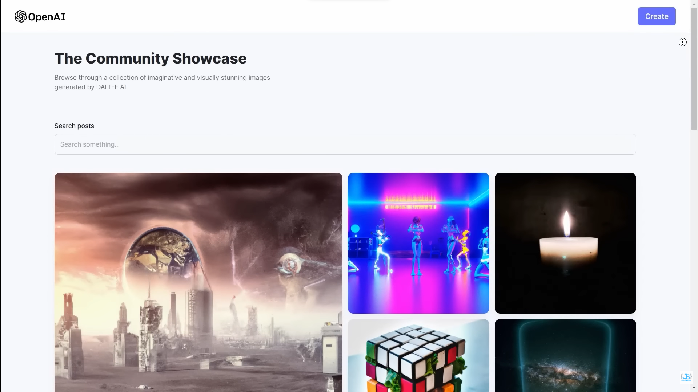
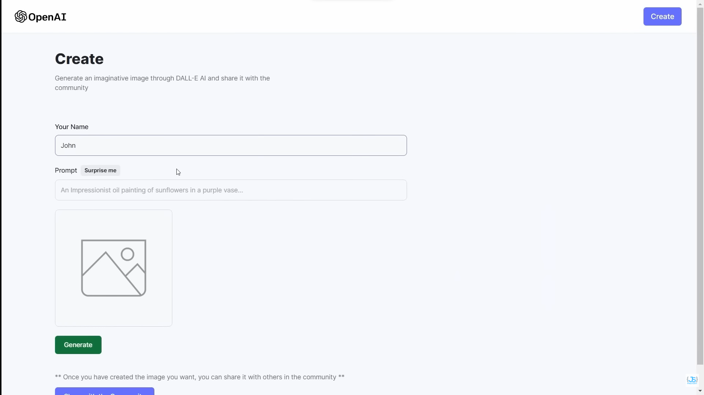

# Full Stack MERN AI Image Generation App MidJourney & DALL E Clone

- Diving into world of Artifical Intelligence via building a modern AI image generation app similar to DALL-E and MidJourney
- Using the MERN(Mongo DB, Express, NodeJS, ReactJS) and other helpful libraries and frameworks such as Tailwind CSS, Open AI DALL-E model, Cloudinary (Cloud-based image storage service)

## Preview of the App

